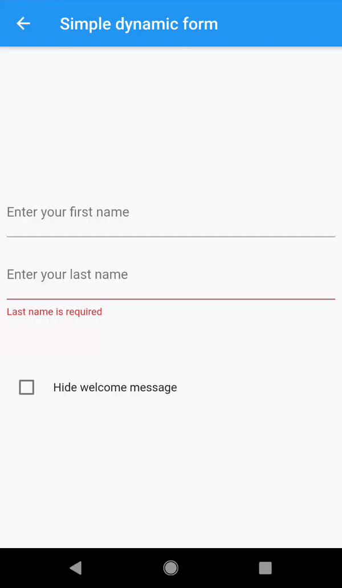

# flutter_dynamic_forms

[](https://travis-ci.com/OndrejKunc/flutter_dynamic_forms)
[](https://codecov.io/gh/OndrejKunc/flutter_dynamic_forms)

A collection of flutter and dart libraries allowing you to dynamicaly define your complex forms outside the app and consume it at runtime.

| Package                                                                            | Pub                                                                                                             |
| ---------------------------------------------------------------------------------- | --------------------------------------------------------------------------------------------------------------- |
| [expression_language](https://github.com/OndrejKunc/flutter_dynamic_forms/tree/master/packages/expression_language)                 | [](https://pub.dev/packages/expression_language)                 |
| [dynamic_forms](https://github.com/OndrejKunc/flutter_dynamic_forms/tree/master/packages/dynamic_forms) | [](https://pub.dev/packages/dynamic_forms) |
| [flutter_dynamic_forms](https://github.com/OndrejKunc/flutter_dynamic_forms/tree/master/packages/flutter_dynamic_forms) | [](https://pub.dev/packages/flutter_dynamic_forms) |
| [flutter_dynamic_forms_components](https://github.com/OndrejKunc/flutter_dynamic_forms/tree/master/packages/flutter_dynamic_forms_components) | [](https://pub.dev/packages/flutter_dynamic_forms_components) |

## Main goal

The idea behind this project is to be able define your forms with all the inputs, validation logic and other rules on the server and consume it in the flutter client without redeploying the app.

This is achieved by defining the form via XML using XAML like syntax or JSON. It has its own expression language to describe all the relationships between properties of each element.

See [example project](packages/flutter_dynamic_forms_components/example) which contains working demo.

## Form definition example

```xml
<?xml version="1.0" encoding="UTF-8"?>
<form id="form1">
    <text
        id="firstName"
        label="Enter your first name">
    </text>
    <text
        id="lastName"
        label="Enter your last name">
        <text.validations>
            <requiredValidation
                message="Last name is required"/>
        </text.validations>
    </text>
    <label
        id="fullNameLabel">
        <label.value>
            <expression>
                <![CDATA[
                    @firstName + (length(@firstName) > 0 && length(@lastName) > 0 ? " " : "") + @lastName
                ]]>
            </expression>
        </label.value>
    </label>
    <label>
        <label.value>
            <expression>
                <![CDATA[
                    "Welcome " + @fullNameLabel + "!"
                ]]>
            </expression>
        </label.value>
        <label.isVisible>
            <expression>
                <![CDATA[
                    !@hideWelcomeCheckBox && length(@fullNameLabel) > 0
                ]]>
            </expression>
        </label.isVisible>
    </label>
    <checkBox
        id="hideWelcomeCheckBox"
        value="false"
        label="Hide welcome message"/>
</form>
```
If you prefer JSON to describe your form please check [json example](packages/flutter_dynamic_forms_components/example/assets/test_form1.json).

<div align="center">
  
  <br />
  <em>Example output</em>
</div>

## Simple Usage

### Installation

Add following dependencies to your `pubspec.yaml` file:

```yaml
flutter_dynamic_forms: ^0.4.0
flutter_dynamic_forms_components: ^0.2.0
```

### Displaying the form

The `flutter_dynamic_forms_components` library contains set of predefined components like Text Input, Label, CheckBox, RadioButtonGroup etc. To make your app work with those components you need to perform the following steps:

First you need to create object called `FormManager`. You can put it inside the `initState` method in your state of your `StatefulWidget`:
```dart
//Get your data somewhere, for demo purposes we use local assets
var data = await rootBundle.loadString("assets/test_form1.xml");

//Use either XmlFormParserService or JsonParserService depending on your form format.
//For default component set use the predefined parser list.
var formManagerBuilder = FormManagerBuilder(XmlFormParserService(getDefaultParserList()));


//Store the _formManager in your state.
_formManager = formManagerBuilder.build(data);
```
The `FormManager` has a getter `form` which is the object representation of your xml/json form in Dart. `FormManager` can also perform some useful operation on the form, like manipulating the state of the form when something happens in the UI, validating the form or collecting all the data from the form so it can be for example sent back to the server.


Before you can render your form, you also need to initialize `FormRenderService`. This service gets list of renderers, where each renderer controls how each component would be rendered on the screen:
```dart
_formRenderService = FormRenderService(
    renderers: getReactiveRenderers(),
    dispatcher: _onFormElementEvent,
);
```
In this example we use set of predefined renderers. The word reactive means that each component will listen to the changes in the form model and will update itself. The `dispatcher` parameter is the callback method which is sent from the renderers when some action is performed (like checkbox checked). We will just delegate this action to our `FormManager`:

```dart
void _onFormElementEvent(FormElementEvent event) {
    if (event is ChangeValueEvent) {
        _formManager.changeValue(
            value: event.value, elementId: event.elementId, propertyName: event.propertyName);
    }
}
```
Since we are using reactive renderes, we don't need to call `setState()` at the end of this method to re-render the form. The library itself will ensure that only the right properties of the form elements will be updated according to this change.

After that you must inform the widget that your form is ready to use:
```dart
setState(() {
    _form = _formManager.form;
});
```

And finally define the build method:

```dart
@override
Widget build(BuildContext context) {
    if (_form == null) {
        return Center(
            child: CircularProgressIndicator(),
        );
    }
    return Center(
        child: SingleChildScrollView(
            child: _formRenderService.render(_form, context),
        ),
    );
}
```

And that's it! Now you can see your form in the action.

### Collect data from the form

The idea behind the process of sending data back to the server is that we shouldn't send back the whole form but only values changed by the user.

To collect the data simply call:
```dart
List<FormItemValue> data = formManager.getFormData()
```

It contains list of all the properties which were marked as a mutable in a component parser definition. In default components those are the properties that are expected to be changed by a user. Each item contains id of the source element, property name and property value.
To submit the form you usually want to serialize this list and send it back to your server.